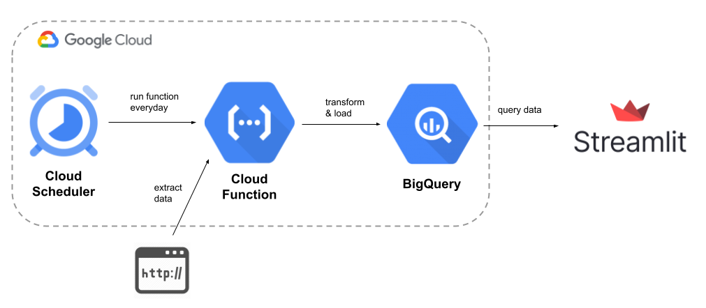

# Introduction


The **Wroclaw Bike Stats** web application aggregates, processes and visualizes data on city bike rides in Wrocław, Poland.

The application is available on the website:  
[wroclawbikestats.streamlit.app](http://wroclawbikestats.streamlit.app)

<br>

How it works?
---



Data on bike rides can be found on the official website of the [Wrocław City Hall](https://opendata.cui.wroclaw.pl/dataset?tags=WRM). The data is in the form of .csv files containing all ride details and is updated daily. The Python script automatically downloads data every day, processes it (e.g. adding coordinates of bike stations, calculating distances, cleaning data) and uploads it to the Bigquery database.

The data is then fetched and further processed by a Python application using [Streamlit](https://streamlit.io/). Thanks to this, it is possible to create a user-friendly interface for exploring data on bike trips.

<br>

Usage
---

The app works with Streamlit. It is available online at:  
[wroclawbikestats.streamlit.app](http://wroclawbikestats.streamlit.app)

You can also clone the entire repository and run it locally. All required libraries are in the `requirements.txt` file:

```
pip install -r requirements.txt
```

Then, you can run a local server with the application; you just need to enter the command:

```
streamlit run Single_day.py
```

**Note:** The application uses a connection to BigQuery and for obvious reasons, credentials are not provided here. There are .csv files with 3 days of bike ride data in the `/samples` directory. You can modify the application code and replace the database connection with importing .csv files.

<br>

App roadmap
---

The current version of the application is only the first stage of development and works on a "proof of concept" basis. Below is a general plan for introducing further features.

⏲️ Time interval - a page will be added with the option of selecting a time interval and displaying various interesting data for this period. It will be possible, for example, to compare how the number of rentals changes within a month, or which bike stations are the most popular.

📍 Bike stations - this page will be devoted to the analysis of data directly related to bike stations. There you will find information such as the list of the most popular stations, the busiest hours for each station, or the most popular directions of departures and arrivals to the station.

📔 2022 data - a page dedicated to the analysis of data on all bike rides from 2022.

🌦️ Weather data – adding basic weather data to the single day data view

<br>

Follow us on Twitter
---

To keep up to date with all updates, follow the app on Twitter:  
[@WroclwBikeStats](https://twitter.com/WroclwBikeStats)  

You will also find there various interesting facts and insights that can be discovered while working on the development of the application.